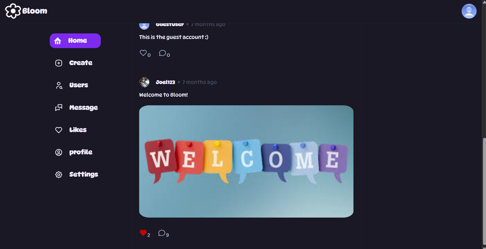
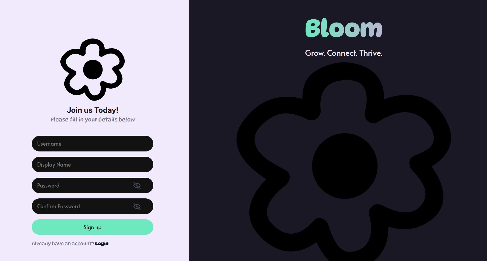
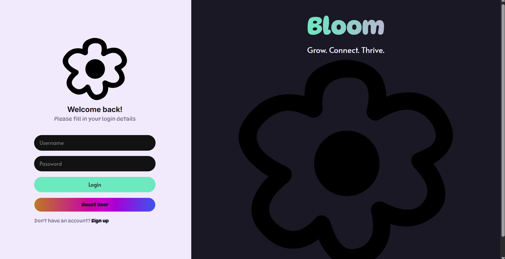
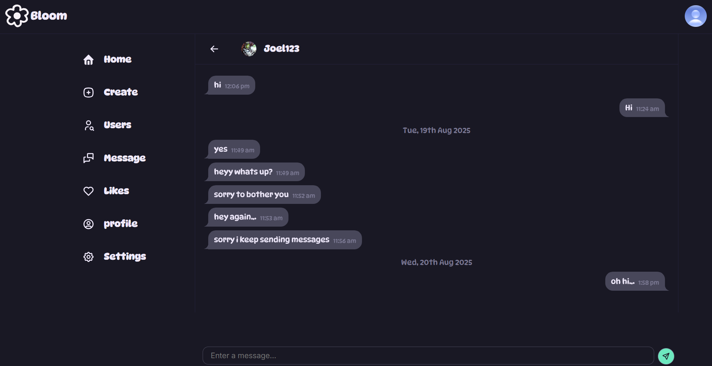
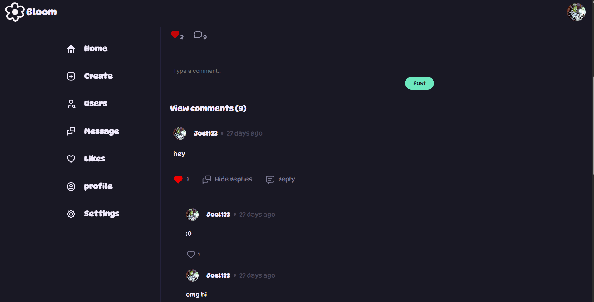
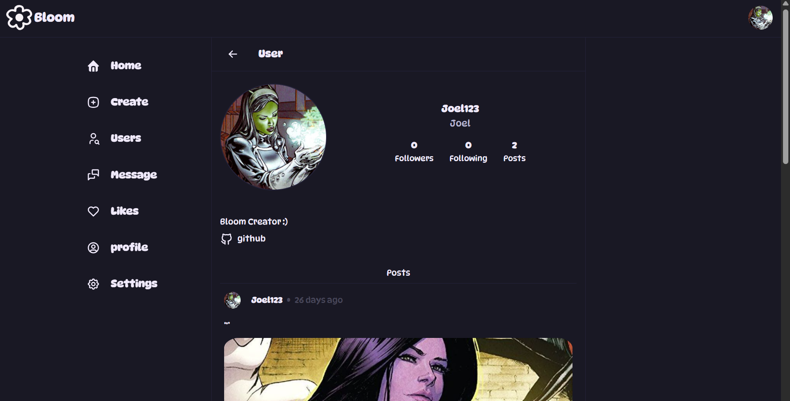
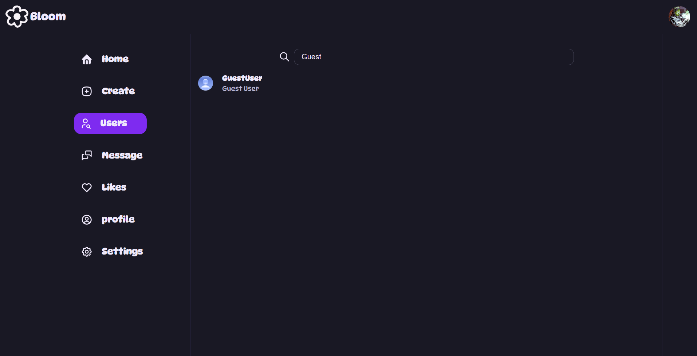
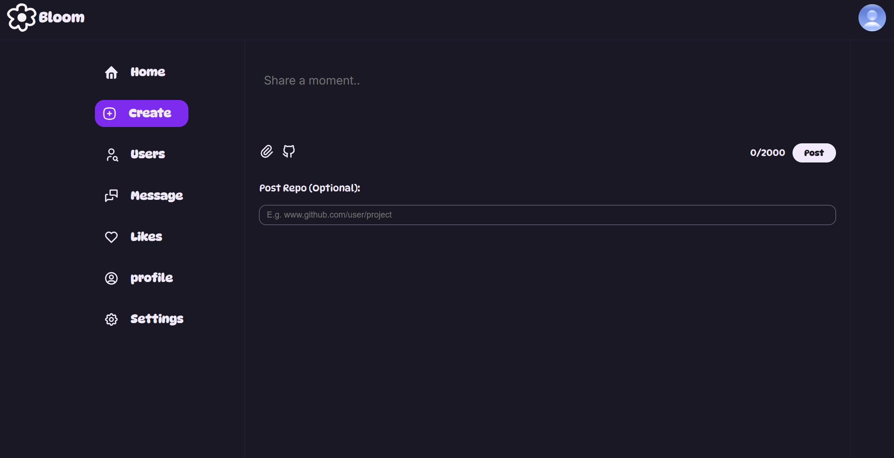

# Social Media Application

This project is a social media application that allows users to create profiles, post content, follow other users, chat with other users and like posts. It is structured into a backend API and a frontend client.

## Project Structure

```
SocialMediaApp
├── backend          # Backend API
│   ├── src         # Source code for the backend
│   ├── package.json # Backend dependencies and scripts
│   └── README.md    # Documentation for the backend
├── frontend         # Frontend client
│   ├── src         # Source code for the frontend
│   ├── package.json # Frontend dependencies and scripts
│   └── README.md    # Documentation for the frontend
└── README.md        # Overall documentation for the project
```

## Features

- **User Authentication**: Users can register, log in, and manage their sessions.
- **User Profiles**: Users can create and update their profiles.
- **Posts**: Users can create, like, and comment on posts.
- **Following**: Users can follow and unfollow other users.

## Screenshots

### Home Page


### Sign-Up Page


### Login Page


### Chat


### Comment


### Profile


### Search Users


### Create Post 


## Technologies Used

- **Backend**: Node.js, Express, MongoDB
- **Frontend**: React, JavaScript
- **Database**: MongoDB for data storage

## Getting Started

### Installation

1. Clone the repository:
   ```
   git clone <repository-url>
   cd SocialMediaApp
   ```

2. Navigate to the backend directory and install dependencies:
   ```
   cd backend
   npm install
   ```

3. Navigate to the frontend directory and install dependencies:
   ```
   cd frontend
   npm install
   ```

### Running the Application

Run the backend and frontend separately:

- Start the backend:
  ```
  cd backend
  npm run serverstart
  ```

- Start the frontend:
  ```
  cd frontend
  npm run dev
  ```
